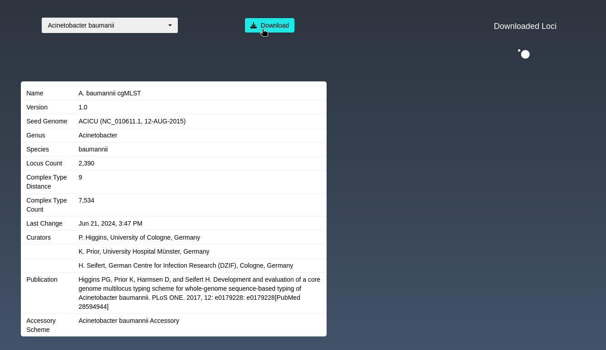
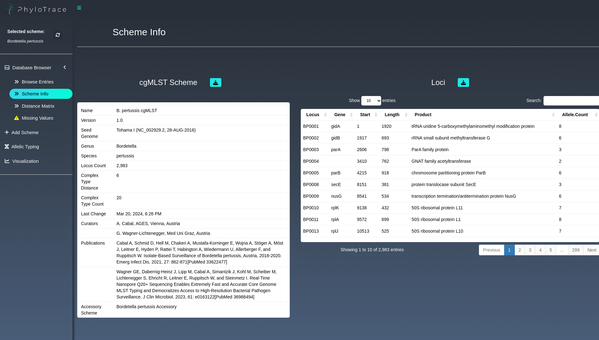
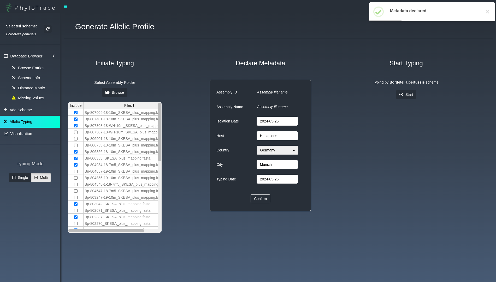
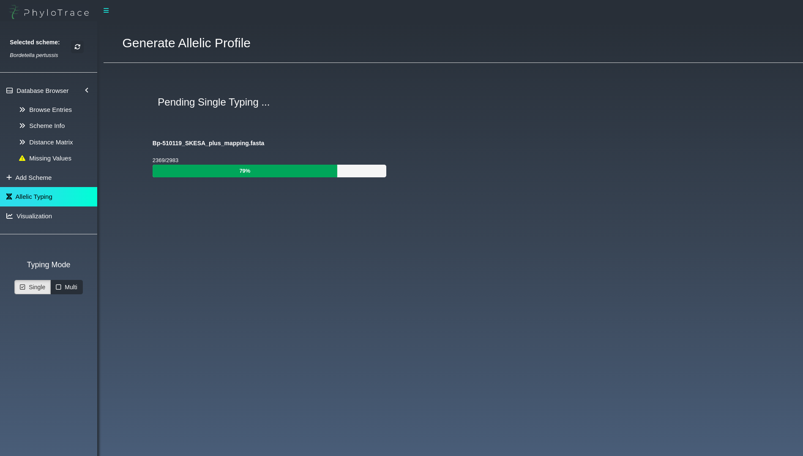
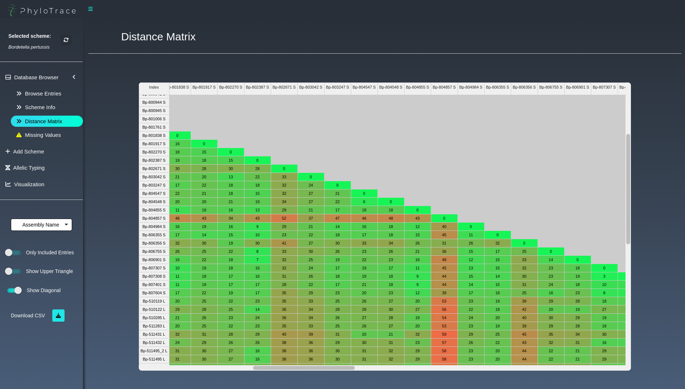
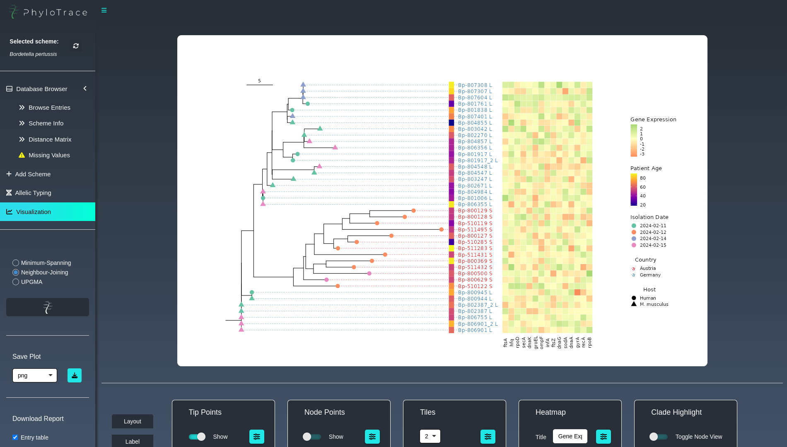
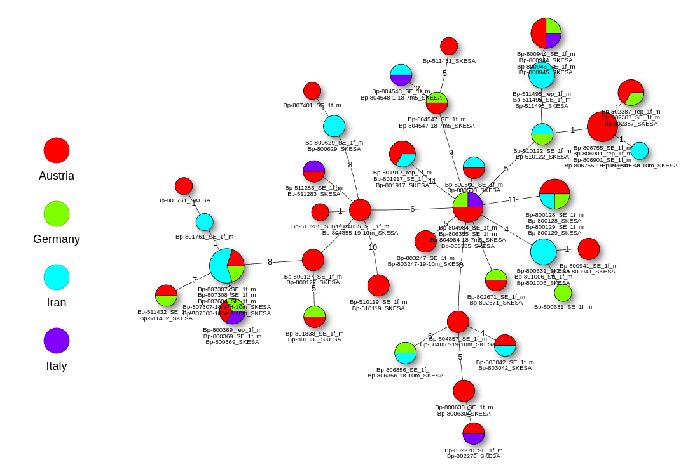

 <br> 
PhyloTrace is a platform for bacterial pathogen monitoring on a genomic level. Its components evolve around Core-Genome Multilocus Sequence Typing (cgMLST) and Antimicrobial Resistance Screening. Complex analyses and computation are wrapped into an appealing and easy-to-handle graphical user interface. Users build a local database comprising analyzed isolates, manageable directly with the application. The visualization of isolate relationship and genetic profile is highly interactive aiding to reveal patterns explaining outbreak dynamics and events by connecting genomic information with epidemiologic variables. PhyloTrace achieves universal compatibility by assigning unique 256-bit hashes based on sequence and allele information. The ability to easily share analysis results enables efficient inter-lab comparison and collaboration.
<br><br>

**Features**

-   Interactive cgMLST analysis also for large datasets comprising numerous whole-genome assemblies
-   Screening for species-specific genes involved in antibiotics resistance, virulence, stress and more 
-   Managing an individual and portable local database to continously monitor bacterial populations
-   Producing publication-ready plots with minimum-spanning tree network graphs and phylogenetic trees (Neighbour-Joining & UPGMA) 
-   Extensive export and report functionalities
-   *and more*

We want to make cgMLST analysis and genomic pathogen monitoring accessible to a broad spectrum of
individuals and organizations. Therefore our goal is to build an interface with convenient user
experience and easy handling that doesn't require you to be a bioinformatician. The app is in active
development. To get a stable version download the newest release. 

*_PhyloTrace is supposed to be used for research and academic purposes only._*

[www.PhyloTrace.com](https://www.phylotrace.com) \|
[info\@phylotrace.com](mailto:info@phylotrace.com?subject=%5BGitHub%5D%20Source%20Han%20Sans)


<sup><sup> Developed in collaboration with Hochschule Furtwangen University (HFU) and Medical
University of Graz (MUG). Featured on ShinyConf 2024. </sup> </sup>

[](https://doi.org/10.5281/zenodo.10996423)
[](https://www.gnu.org/licenses/gpl-3.0)


  


----------------------------------------------------------------------------------------------------

## Table of Content

-   [1 Getting Started](#1-getting-started)
    -   [1.1 Workflow](#11-workflow)
    -   [1.2 Compatibility](#12-compatibility)
    -   [1.3 Citation](#13-citation)
-   [2 Installation](#2-installation)
    -   [2.1 Download Source Code](#21-download-source-code)
    -   [2.2 Install Miniconda](#22-install-miniconda)
    -   [2.3 Create Conda Environment](#23-create-conda-environment)
    -   [2.4 Create Launcher](#24-create-desktop-launcher)
    -   [2.5 Uninstall](#25-uninstall)
    -   [2.6 Troubleshooting](#26-troubleshooting)
-   [3 Launch PhyloTrace](#3-launch-phylotrace)
-   [4 Roadmap](#4-roadmap)

## 1 Getting Started

PhyloTrace is an open-source platform for *in silico* bacterial typing with core-genome multilocus
sequence typing (cgMLST). This method allows pathogen monitoring on a genomic level by typing allele
variants in order to profile the present genetic constitution for individual isolates of a bacterial
population. Comparing the allelic profile to other isolates of the same species might reveal
coherences that are not visible by the bare eye. Visualizing the generated data enables humans to
identify patterns of epidemiologic dynamics (transmission, outbreak variants, source
identification), relatedness and population structure. To work with PhyloTrace all that is needed
are whole-genome assemblies which demarcate the starting point of the workflow. Easily pipe the
files into the cgMLST analysis and step-by-step build up a local database, which can be managed with
full control through the app. Visualize and export results in a publication-ready format.

## 1.1 Workflow

The **user manual** containing detailed instruction and information is available at
[www.phylotrace.com/user-manual](https://www.phylotrace.com/user-manual).

<details open>

<summary><b>Downloading cgMLST Scheme</b></summary>

<br>

Download a standardized scheme that defines the genetic targets, nomenclature and variant sequences
for the bacterial species of interest from the [cgMLST.org](https://www.cgmlst.org/ncs) public
database. The connection to the server including information on the scheme is integrated in the app.
Once one of the 32 available species has been selected and downloaded, everything is ready to go.

<div style="display: flex; justify-content: space-between;">


</div>

<br>

</details>

<details>

<summary><b>Allelic Typing</b></summary>

<br>

Whole-genome assemblies (`.fasta`) can be entered into the pipeline and are automatically analyzed
at high speed. Using the downloaded cgMLST scheme, the bacterial genome is aligned to the known
variants at the respective genetic target. By iterating this process over all genes that are part of
the core genome, an individual allele profile is generated. If a potential new genetic variant is
discovered, it is checked whether the existing allele is still capable of producing a functional
protein. Successfully typed assemblies are appended to the local database in real time.\

<div style="display: flex; justify-content: space-between;">


</div>

<br>

</details>

<details>

<summary><b>Building and Managing Database</b></summary>

<br>

Step-by-step the database is filled with typed isolates and the connected metadata. The database
browser provides full control allowing to edit, delete and inspect the entries that were added so
far. It features several functions, e.g. to export the table, compare allelic profiles or to
introduce custom variables with information about presence/absence of antimicrobial resistances,
gene expression values or any other characteristic, to answer individual research questions.

<div style="display: flex; justify-content: space-between;">


</div>

<br>

</details>

<details>

<summary><b>Visualizing Results</b></summary>

<br>

Create and customize sophisticated phylogenetic trees (Neighbour-Joining & UPGMA) or networks
(Minimum-spanning) to visualize the underlying relationship between the isolates in your local
database. The plots can be heavily modified and enriched with useful information e.g. by mapping
previously added custom variables. The resulting visuals can be saved in multiple formats and even
included in a report document that can be generated from within the app.\

<div style="display: flex; justify-content: space-between;">


</div>

<br>

</details>

### 1.2 Compatibility

#### Minimum System Requirements

| Component        | Description                                                                                                    |
|-----------------------------------------------------------|-----------------------------------------|
| Operating System | Any Linux distribution capable of running R and Conda (e.g. Ubuntu, Fedora, Debian, ArchLinux, OpenSuse, etc.) |
| Web Browser      | Compatible with latest version of major browsers (Chrome, Brave, Chromium, Opera, Vivaldi)                     |
| Storage          | ≥ 250 GB SSD/HDD                                                                                               |
| RAM              | ≥ 8 GB                                                                                                         |
| CPU              | Multi-core processor, ≥ 2.5 GHz                                                                                |

> *These system requirements are provided as estimates. It is possible for the application to run on
> lower-spec systems, depending on application workload and usage patterns.*

> *The **Firefox** browser has display-issues that might impair the usage.*

### 1.3 Citation

If you use PhyloTrace for your paper or publication, cite us with

-   *Freisleben, M. & Paskali, F. (2024). PhyloTrace. Zenodo. DOI: 10.5281/zenodo.10996423.*

```         
@software{Freisleben_Paskali_2024,
  author       = {Freisleben, Marian and Paskali, Filip},
  title        = {PhyloTrace},
  year         = {2024},
  publisher    = {Zenodo},
  doi          = {10.5281/zenodo.10996423},
  url          = {https://doi.org/10.5281/zenodo.10996423}
}
```

## 2 Installation

PhyloTrace can be installed in a linux environment and, using Windows Subsystem for Linux (WSL) also on Microsoft Windows. 

> <i>If an older version is already installed on your system, make sure to first uninstall PhyloTrace
> (see [2.5 Uninstall](#25-uninstall)). Since the local database folder is located outside of the
> app directory the previous analyses and isolates remain unaffected. To update to the newer version
> first uninstall the previous one, download the new version and follow the complete installation
> procedure as described below.</i>

For the installation on a linux OS follow the steps starting from [2.2 Install Miniconda](#22-install-miniconda). If you want to install PhyloTrace on Microsoft Windows, you must first follow the steps found in the collapsible menu below before proceeding with the other steps.

<details>
<br>
<summary><b>Installing PhyloTrace on Windows using WSL (Windows Subsystem for Linux)</b></summary>

To install Ubuntu on WSL, start PowerShell as administrator and run the following command:

``` PowerShell
wsl --install
```
When the installation is complete, a prompt will appear for new UNIX username and password. Enter 
the preferred username and password. 

After successful installation, WSL can be started from Start Menu by launching WSL or Ubuntu shortcut.

For the full functionality of PhyloTrace, WSL utilities should be installed. Start WSL and enter the
following commands:

``` bash
sudo add-apt-repository ppa:wslutilities/wslu
sudo apt update
sudo apt install wslu
```

After this, the instructions from [2.2 Install Miniconda](#22-install-miniconda) should be followed.

</details>

### 2.1 Download Source Code

Donwload the source code of the latest stable version. 

Use the terminal to navigate to an accessible location on your system ```path/to/phylotrace``` and clone the repository using Git.

```
cd path/to/phylotrace
git clone https://github.com/infinity-a11y/PhyloTrace.git
```

Alternatively download PhyloTrace manually from [Version 1.4.1](https://github.com/infinity-a11y/PhyloTrace/archive/refs/tags/v1.4.1.zip) and extract/unzip it to a location on your system.


### 2.2 Install Miniconda

Is ***Miniconda*** or another ***Conda Distribution*** installed on the system?  

**No**  :arrow_right: Run the installation below and initialize conda  <br>
 
**Yes** :arrow_right: Proceed to [2.3 Create Conda Environment](#23-create-conda-environment) 

These four commands quickly and quietly install the latest 64-bit version of Miniconda and then
clean up after themselves. 

> _For installation of Miniconda on system with different architecture, please refer to the [Miniconda documentation](https://docs.anaconda.com/free/miniconda/index.html)._

``` bash
mkdir -p ~/miniconda3
wget https://repo.anaconda.com/miniconda/Miniconda3-latest-Linux-x86_64.sh -O ~/miniconda3/miniconda.sh
bash ~/miniconda3/miniconda.sh -b -u -p ~/miniconda3
rm ~/miniconda3/miniconda.sh
```

After installation, the newly-installed Miniconda should be initialized with the following command:

``` bash
~/miniconda3/bin/conda init
```

To start using conda, the terminal should be restarted.

> ***Optional:*** *To disable automatic activation of conda whenever the terminal is started, the
> following command can be executed:*

``` bash
conda config --set auto_activate_base false
```

### 2.3 Create Conda Environment

Create a conda environment containing necessary dependencies and packages.

``` bash
cd path/to/phylotrace
conda env create -f PhyloTrace.yml
```

> *In the command above, replace `path/to/phylotrace` with the actual path linking to the PhyloTrace
> directory on your system.* *This process might take a while (depends on system performance).*

### 2.4 Create Desktop Launcher

Run install script to generate a run script and include PhyloTrace desktop icon in the Applications
Menu.

``` bash
cd path/to/phylotrace
bash install_phylotrace.sh
```

> *In the command above, replace `path/to/phylotrace` with the actual path linking to the PhyloTrace
> directory on your system.*

### 2.5 Uninstall

To uninstall PhyloTrace from your system, remove the application directory and run the following
command to remove the desktop launcher and the PhyloTrace conda environment:

``` bash
rm $HOME/.local/share/applications/PhyloTrace.desktop
rm $HOME/.local/share/icons/hicolor/scalable/apps/PhyloTrace.png
conda remove -n PhyloTrace --all -y
```

### 2.6 Troubleshooting

There are multiple possible sources for issues with the installation. Common mistakes during the
installation are: - Change `path/to/phylotrace` in the command chunks with the actual path of the
repository containing all PhyloTrace files - Before installation make sure the whole repository is
unzipped to a writable location in your system

If the installation issues persist feel free to contact us via
[info\@phylotrace.com](mailto:info@phylotrace.com?subject=%5BGitHub%5D%20Source%20Han%20Sans) or
open an issue.

#### Desktop Launcher not Working

If the desktop launcher is not working, the currently set default browser is likely not declared
properly. To resolve this, change the R_BROWSER environment variable to the executable name of the
desired browser (executable names for popular browsers are listed in the table below). For example
to use Google Chrome, execute the following command:

``` bash
cd path/to/phylotrace
R_BROWSER=google-chrome
bash run_phylotrace.sh
```

> *In the command above, replace `path/to/phylotrace` with the actual path linking to the PhyloTrace
> directory on your system.*

| Browser       | *browser-name*                                |
|---------------|-----------------------------------------------|
| Google Chrome | *google-chrome* **or** *google-chrome-stable* |
| Chromium      | *chromium*                                    |
| Brave         | *brave-browser*                               |
| Opera         | *opera*                                       |
| Vivaldi       | *vivaldi*                                     |

## 3 Launch PhyloTrace

**Linux** - Start PhyloTrace by using the launcher in Applications Menu. A browser tab with the app will
automatically open in the default browser.

 <br>

**Launching from terminal (and for Microsoft Windows)**

For Windows users, or if launching from the Linux desktop does not work, the alternative way to run the app is to execute these
commands:

``` bash
cd path/to/phylotrace
bash run_phylotrace.sh
```

> *In the command above, replace `path/to/phylotrace` with the actual path linking to the PhyloTrace
> directory on your system.*

> _To install and use PhyloTrace on Windows, a user account with administration rights is required._

The **user manual** containing documentation is available at
[www.phylotrace.com/user-manual](https://www.phylotrace.com/user-manual).

## 4 Roadmap

PhyloTrace is under active development with new functions, enhancements and innovations to follow.
In addition to the points listed on the roadmap, we constantly improve existing features.

✅ ***"Hello World!"*** - Version 1.0.0\
✅ Sophisticated MST Graphs (e.g. Pie Charts as Nodes)\
✅ Compatibility with Microsoft Windows\
✅ Hash-based Decentralized cgMLST\
✅ MST Graph Clustering\
🔲 Support for additional cgMLST scheme databases (e.g. pubMLST, EnteroBase, Institut Pasteur)\
🔲 Implementation of a NGS Assembly Pipeline\
🔲 Backwards Compatibility with MLST (ST calling)\
🔲 Implementation of wgMLST\
🔲 Implementation of a Gene Enrichment Analysis\
