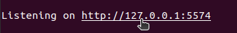
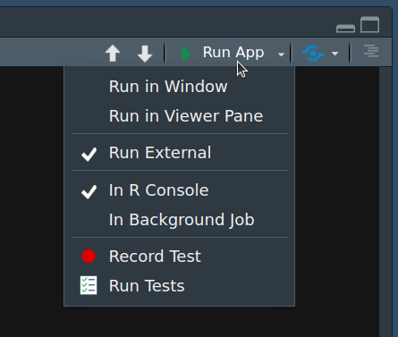

<picture>
    <source media="(prefers-color-scheme: light)" srcset="www/PhyloTrace_bw.png">
    <source media="(prefers-color-scheme: dark)" srcset="www/PhyloTrace.png">    
    
</picture>

##

Download the complete repository as .zip and extract it to any location on your system.
Follow these instructions to install the required dependencies.

# 1 Installation

## 1.1 Install R

Before installing the dependencies, ensure that you have R and RStudio installed on your system. Follow the instructions below:

1. Download the latest version of R for your operating system from [the CRAN website](https://cran.r-project.org/).
2. Install R by executing the downloaded file and following the installation prompts.

```bash
cd ~ \
 && wget https://cran.r-project.org/src/base/R-4/R-4.3.2.tar.gz \
 && tar xvf R-4.3.2.tar.gz \
 && cd R-4.3.2 \
 && ./configure --prefix=$HOME \
 && make && make install \
 && cd ~
```

Create writable R library 
```bash
mkdir ~/R-4.3.2/library
```

[Optional: Download RStudio IDE]

3. Download RStudio from [the RStudio website](https://rstudio.com/products/rstudio/download/).
4. Install RStudio by executing the downloaded file and following the installation prompts.

## 1.2 Install System Libraries

```bash
sudo apt-get update && sudo apt-get install -y \
    zlib1g-dev \
    liblapack-dev \
    libblas-dev \
    libmkl-rt \
    libopenblas-dev \
    gfortran \
    libcurl4-openssl-dev \
    libxml2-dev \
    libfontconfig1-dev \
    libharfbuzz-dev \
    libfribidi-dev \
    libfreetype6-dev \
    libpng-dev \
    libtiff5-dev \
    libjpeg-dev \
    libz-dev \
    pandoc \
    wget
```


## 1.3 Install Miniconda

```bash
wget https://repo.anaconda.com/miniconda/Miniconda3-latest-Linux-x86_64.sh -O ~/miniconda.sh 
```
```bash
bash ~/miniconda.sh -b -u
```
```bash
~/miniconda3/bin/conda create --name PhyloTrace
```

```bash
source ~/miniconda3/bin/activate PhyloTrace
```

## 1.4 Install KMA via Conda

```bash
conda install -n PhyloTrace -c bioconda kma
```

## 1.5 Running PhyloTrace

Before using PhyloTrace, install the required packages and dependencies by running the initialization script.
```bash
cd path/to/directory
Rscript init.R
```
>Note: In the command above, replace *path/to/directory* with the actual path where you extracted the repository to.

### 1.5.1 Running from Terminal (no RStudio required)

1. Navigate to the local directory
```bash
cd path/to/directory
```
>Note: In the command above, replace *path/to/directory* with the actual path where you extracted the repository to.

2. Start the app by running this command from within the directory
```bash
Rscript PhyloTrace_App.R
```

3. Open the app in the browser by clicking the displayed port in the terminal or copying the port to the address bar of your browser.

>Note: Upon first start, the packages are automatically installed. This process can take a while. After successful installation, the port will be displayed.  

   

### 1.5.2 Running from RStudio

Open PhyloTrace.R from its directory with RStudio and start it by clicking "Run App" (make sure to tick "Run External" to open it in the default browser).


